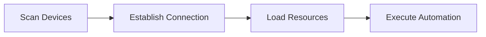

<!-- markdownlint-disable MD033 MD041 MD024 -->
<p align="center">
  
</p>

<div align="center">

# MaaMCP

[](LICENSE)
[](https://github.com/MaaXYZ/MaaFramework)
[](https://www.python.org/)

基于 [MaaFramework](https://github.com/MaaXYZ/MaaFramework) 的 MCP 服务器
为 AI 助手提供 Android 设备和 Windows 桌面自动化能力

[English](#english) | [中文](#中文)

</div>

---

## 中文

### 简介

MaaMCP 是一个 MCP 服务器，将 MaaFramework 的强大自动化能力通过标准化的 MCP 接口暴露给 AI 助手（如 Claude）。通过本服务器，AI 助手可以：

- 🤖 **Android 自动化** - 通过 ADB 连接并控制 Android 设备/模拟器
- 🖥️ **Windows 自动化** - 控制 Windows 桌面应用程序
- 🔗 **多设备协同** - 同时控制多个设备/窗口，实现跨设备自动化
- 👁️ **智能识别** - 使用 OCR 识别屏幕文字内容
- 🎯 **精准操作** - 执行点击、滑动、文本输入、按键等操作
- 📸 **屏幕截图** - 获取实时屏幕截图进行视觉分析

Talk is cheap, 请看: **[🎞️ Bilibili 视频演示](https://www.bilibili.com/video/BV1eGmhBaEZz/)**

### 功能特性

#### 🔍 设备发现与连接

- `find_adb_device_list` - 扫描可用的 ADB 设备
- `find_window_list` - 扫描可用的 Windows 窗口
- `connect_adb_device` - 连接到 Android 设备
- `connect_window` - 连接到 Windows 窗口

#### 📦 资源管理

- `load_resource` - 加载 OCR 模型和图像资源

#### 👀 屏幕识别

- `ocr` - 光学字符识别（高效，推荐优先使用）
- `screencap` - 屏幕截图（按需使用，token 开销大）

#### 🎮 设备控制

- `click` - 点击指定坐标（支持多触点/鼠标按键选择、长按）
  - Windows 上支持指定鼠标按键：左键(0)、右键(1)、中键(2)
- `double_click` - 双击指定坐标
- `swipe` - 滑动手势
- `input_text` - 输入文本
- `click_key` - 按键操作（支持长按）
  - Android 上可模拟系统按键：返回键(4)、Home键(3)、菜单键(82)、音量键等
  - Windows 上支持虚拟按键码：回车(13)、ESC(27)、方向键等
- `scroll` - 鼠标滚轮（仅 Windows）

### 快速开始

#### 安装步骤

1. **克隆仓库**

    ```bash
    git clone https://github.com/MistEO/MaaMCP.git
    cd MaaMCP
    ```

2. **下载 OCR 模型**（大文件，可能需要一些时间）

    ```bash
    git submodule update --init --recursive
    ```

    如果 git 下载失败，可前往 [Mirror酱](https://mirrorchyan.com/zh/projects?rid=MaaCommonAssets) 手动下载后解压到 `assets/MaaCommonAssets`。

3. **配置 OCR 模型**

    ```bash
    python configure.py
    ```

4. **安装 Python 依赖**

    ```bash
    pip install -r mcp_server/requirements.txt
    ```

#### 配置 MCP 客户端

##### Cursor IDE

仓库已内置 `.cursor/mcp.json`，重载 Cursor 窗口后生效

##### Claude Code CLI

仓库已内置 `.claude/settings.local.json`，重新启动 Claude Code CLI 后生效

##### 其他客户端

请参考上述 Cursor 或者 Claude Code 的配置设置。MaaMCP 启动方式为：

```shell
cd MaaMCP
python -m mcp_server
```

### 使用示例

配置完成后，在 Cursor 中可以这样使用：

**Android 自动化示例：**

```text
请用 MaaMCP 工具帮我连接 Android 设备，打开美团帮我点一份外卖，我想吃中餐，一人份，20 元左右的
```

**Windows 自动化示例：**

```text
请用 MaaMCP 工具，看看我现在这页 PPT 怎么加一个旋转特效，操作给我看下
```

MaaMCP 会自动：

1. 扫描可用设备/窗口
2. 建立连接
3. 加载必要的资源
4. 执行识别和操作任务

### 工作流程

MaaMCP 遵循简洁的操作流程，支持多设备/多窗口协同工作：


1. **扫描** - 使用 `find_adb_device_list` 或 `find_window_list`
2. **连接** - 使用 `connect_adb_device` 或 `connect_window`（可连接多个设备/窗口，获得多个控制器 ID）
3. **加载** - 使用 `load_resource` 加载 OCR 模型（只需加载一次）
4. **操作** - 通过指定不同的控制器 ID，对多个设备/窗口执行 OCR、点击、滑动等自动化操作

### 安全说明

⚠️ **重要安全约束**：

- 所有 ADB 和窗口操作必须通过 MCP 工具执行
- 禁止直接执行 `adb` 命令或窗口句柄 API
- 这确保了 AI 助手操作的可控性和安全性

### 常见问题

#### OCR 识别失败，报错 "Failed to load det or rec"

确保已正确执行步骤 3 和 4：

1. 检查 `assets/MaaCommonAssets/OCR` 目录是否存在
2. 重新运行 `python configure.py`
3. 验证 `assets/resource/model/ocr` 目录包含模型文件

### 许可证

本项目采用 [GNU AGPL v3](LICENSE) 许可证。

### 致谢

- **[MaaFramework](https://github.com/MaaXYZ/MaaFramework)** - 提供强大的自动化框架
- **[FastMCP](https://github.com/jlowin/fastmcp)** - 简化 MCP 服务器开发
- **[Model Context Protocol](https://modelcontextprotocol.io/)** - 定义 AI 工具集成标准

---

## English

### Introduction

MaaMCP is a Model Context Protocol server that exposes MaaFramework's powerful automation capabilities through standardized MCP interfaces to AI assistants (like Claude). With this server, AI assistants can:

- 🤖 **Android Automation** - Connect and control Android devices/emulators via ADB
- 🖥️ **Windows Automation** - Control Windows desktop applications
- 🔗 **Multi-Device Coordination** - Control multiple devices/windows simultaneously for cross-device automation
- 👁️ **Smart Recognition** - Use OCR to recognize on-screen text
- 🎯 **Precise Operations** - Execute clicks, swipes, text input, key presses, and more
- 📸 **Screenshots** - Capture real-time screenshots for visual analysis

### Features

#### 🔍 Device Discovery & Connection

- `find_adb_device_list` - Scan available ADB devices
- `find_window_list` - Scan available Windows windows
- `connect_adb_device` - Connect to Android device
- `connect_window` - Connect to Windows window

#### 📦 Resource Management

- `load_resource` - Load OCR models and image resources

#### 👀 Screen Recognition

- `ocr` - Optical Character Recognition (efficient, recommended)
- `screencap` - Screenshot capture (use sparingly, high token cost)

#### 🎮 Device Control

- `click` - Click at coordinates (supports multi-touch/mouse button selection, long press)
  - On Windows, supports mouse button selection: left(0), right(1), middle(2)
- `double_click` - Double click at coordinates
- `swipe` - Swipe gesture
- `input_text` - Input text
- `click_key` - Key press (supports long press)
  - On Android, simulates system keys: Back(4), Home(3), Menu(82), Volume keys, etc.
  - On Windows, supports virtual key codes: Enter(13), ESC(27), Arrow keys, etc.
- `scroll` - Mouse wheel (Windows only)

### Quick Start

#### Installation

1. **Clone the repository**

    ```bash
    git clone https://github.com/MistEO/MaaMCP.git
    cd MaaMCP
    ```

2. **Download OCR models** (large files, may take time)

    ```bash
    git submodule update --init --recursive
    ```

3. **Configure OCR models**

    ```bash
    python configure.py
    ```

4. **Install Python dependencies**

    ```bash
    pip install -r mcp_server/requirements.txt
    ```

#### Configure MCP Clients

##### Cursor IDE

The repo includes `.cursor/mcp.json`. Reload the Cursor window to apply.

##### Claude Code CLI

The repo includes `.claude/settings.local.json`. Restart Claude Code CLI to apply.

##### Other clients

You can follow the Cursor/Claude Code config approach above. MaaMCP can be started with:

```shell
cd MaaMCP
python -m mcp_server
```

### Usage Examples

After configuration, you can use it in Cursor:

**Android Automation Example:**

```text
Please use the MaaMCP tools to connect to my Android device, open Meituan, and help me order a Chinese meal (one portion) around 20 RMB.
```

**Windows Automation Example:**

```text
Please use the MaaMCP tools to show me how to add a rotation animation effect to the current PPT slide, and demonstrate the steps.
```

MaaMCP will automatically:

1. Scan available devices/windows
2. Establish connection
3. Load necessary resources
4. Execute recognition and operation tasks

### Workflow

MaaMCP follows a streamlined operational workflow with multi-device/window coordination support:



1. **Scan** - Use `find_adb_device_list` or `find_window_list`
2. **Connect** - Use `connect_adb_device` or `connect_window` (can connect multiple devices/windows, each gets a unique controller ID)
3. **Load** - Use `load_resource` to load OCR models (only needs to be loaded once)
4. **Operate** - Execute OCR, click, swipe, etc. on multiple devices/windows by specifying different controller IDs

### Security Notes

⚠️ **Important Security Constraints**:

- All ADB and window operations must go through MCP tools
- Direct execution of `adb` commands or window handle APIs is prohibited
- This ensures AI assistant operations are controlled and secure

### FAQ

#### OCR recognition fails with "Failed to load det or rec"

Ensure steps 3 and 4 were completed correctly:

1. Check if `assets/MaaCommonAssets/OCR` directory exists
2. Re-run `python configure.py`
3. Verify `assets/resource/model/ocr` directory contains model files

### License

This project is licensed under [GNU AGPL v3](LICENSE).

### Acknowledgments

- **[MaaFramework](https://github.com/MaaXYZ/MaaFramework)** - Provides powerful automation framework
- **[FastMCP](https://github.com/jlowin/fastmcp)** - Simplifies MCP server development
- **[Model Context Protocol](https://modelcontextprotocol.io/)** - Defines AI tool integration standards
