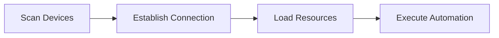

<!-- markdownlint-disable MD033 MD041 MD024 -->
<p align="center">
  
</p>

<div align="center">

# MaaMCP

[](LICENSE)
[](https://github.com/MaaXYZ/MaaFramework)
[](https://www.python.org/)

MCP Server based on [MaaFramework](https://github.com/MaaXYZ/MaaFramework)
Providing Android device and Windows desktop automation capabilities for AI assistants

English | [中文](README.md)

</div>

---

## Introduction

MaaMCP is a Model Context Protocol server that exposes MaaFramework's powerful automation capabilities through standardized MCP interfaces to AI assistants (like Claude). With this server, AI assistants can:

- 🤖 **Android Automation** - Connect and control Android devices/emulators via ADB
- 🖥️ **Windows Automation** - Control Windows desktop applications
  - 🎯 **Background Operation** - Screenshots and controls on Windows run in the background without occupying your mouse or keyboard, allowing you to continue using your computer for other tasks
- 🔗 **Multi-Device Coordination** - Control multiple devices/windows simultaneously for cross-device automation
- 👁️ **Smart Recognition** - Use OCR to recognize on-screen text
- 🎯 **Precise Operations** - Execute clicks, swipes, text input, key presses, and more
- 📸 **Screenshots** - Capture real-time screenshots for visual analysis

## Features

### 🔍 Device Discovery & Connection

- `find_adb_device_list` - Scan available ADB devices
- `find_window_list` - Scan available Windows windows
- `connect_adb_device` - Connect to Android device
- `connect_window` - Connect to Windows window

### 📦 Resource Management

- `load_resource` - Load OCR models and image resources

### 👀 Screen Recognition

- `ocr` - Optical Character Recognition (efficient, recommended)
- `screencap` - Screenshot capture (use sparingly, high token cost)

### 🎮 Device Control

- `click` - Click at coordinates (supports multi-touch/mouse button selection, long press)
  - On Windows, supports mouse button selection: left(0), right(1), middle(2)
- `double_click` - Double click at coordinates
- `swipe` - Swipe gesture
- `input_text` - Input text
- `click_key` - Key press (supports long press)
  - On Android, simulates system keys: Back(4), Home(3), Menu(82), Volume keys, etc.
  - On Windows, supports virtual key codes: Enter(13), ESC(27), Arrow keys, etc.
- `scroll` - Mouse wheel (Windows only)

## Quick Start

### Installation

1. **Clone the repository**

    ```bash
    git clone https://github.com/MistEO/MaaMCP.git
    cd MaaMCP
    ```

2. **Install Python dependencies**

    ```bash
    pip install -r maa_mcp/requirements.txt
    ```

### Configure MCP Clients

#### Cursor IDE

The repo includes `.cursor/mcp.json`. Reload the Cursor window to apply.

#### Claude Code CLI

The repo includes `.claude/settings.local.json`. Restart Claude Code CLI to apply.

#### Other clients

You can follow the Cursor/Claude Code config approach above. MaaMCP can be started with:

```shell
cd MaaMCP
python -m maa_mcp
```

## Usage Examples

After configuration, you can use it in Cursor:

**Android Automation Example:**

```text
Please use the MaaMCP tools to connect to my Android device, open Meituan, and help me order a Chinese meal (one portion) around 20 RMB.
```

**Windows Automation Example:**

```text
Please use the MaaMCP tools to show me how to add a rotation animation effect to the current PPT slide, and demonstrate the steps.
```

MaaMCP will automatically:

1. Scan available devices/windows
2. Establish connection
3. Load necessary resources
4. Execute recognition and operation tasks

## Workflow

MaaMCP follows a streamlined operational workflow with multi-device/window coordination support:



1. **Scan** - Use `find_adb_device_list` or `find_window_list`
2. **Connect** - Use `connect_adb_device` or `connect_window` (can connect multiple devices/windows, each gets a unique controller ID)
3. **Load** - Use `load_resource` to load OCR models (only needs to be loaded once)
4. **Operate** - Execute OCR, click, swipe, etc. on multiple devices/windows by specifying different controller IDs

## Security Notes

⚠️ **Important Security Constraints**:

- All ADB and window operations must go through MCP tools
- Direct execution of `adb` commands or window handle APIs is prohibited
- This ensures AI assistant operations are controlled and secure

## Notes

📌 **Windows Automation Limitations**:

- Some games or applications with anti-cheat mechanisms may block background control operations
- If the target application runs with administrator privileges, MaaMCP must also be launched with administrator privileges
- Minimized windows are not supported; please keep the target window in a non-minimized state

## FAQ

### OCR recognition fails with "Failed to load det or rec"

Ensure steps 3 and 4 were completed correctly:

1. Check if `assets/MaaCommonAssets/OCR` directory exists
2. Re-run `python configure.py`
3. Verify `assets/resource/model/ocr` directory contains model files

## License

This project is licensed under [GNU AGPL v3](LICENSE).

## Acknowledgments

- **[MaaFramework](https://github.com/MaaXYZ/MaaFramework)** - Provides powerful automation framework
- **[FastMCP](https://github.com/jlowin/fastmcp)** - Simplifies MCP server development
- **[Model Context Protocol](https://modelcontextprotocol.io/)** - Defines AI tool integration standards
